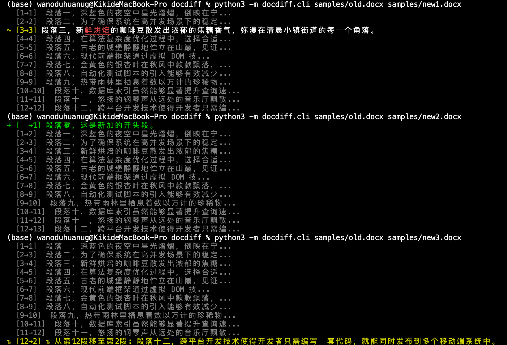
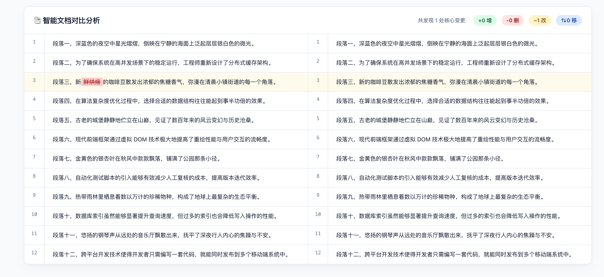
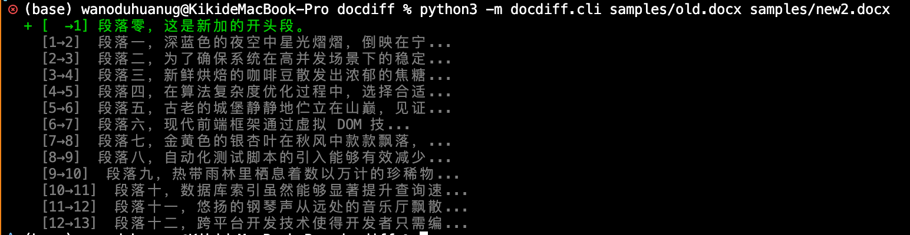
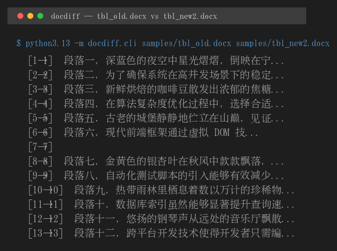
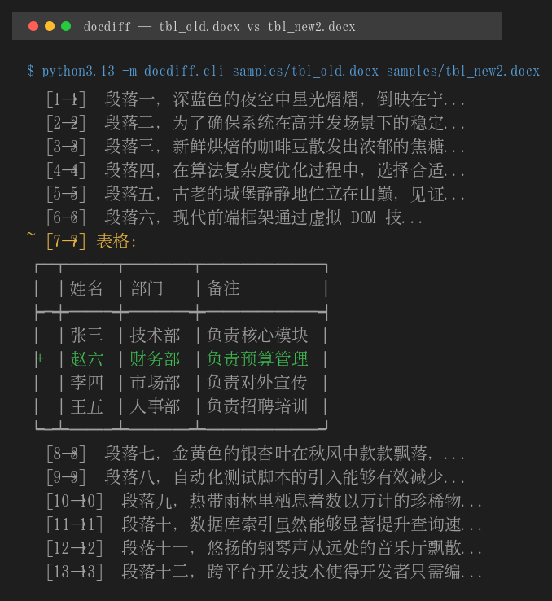
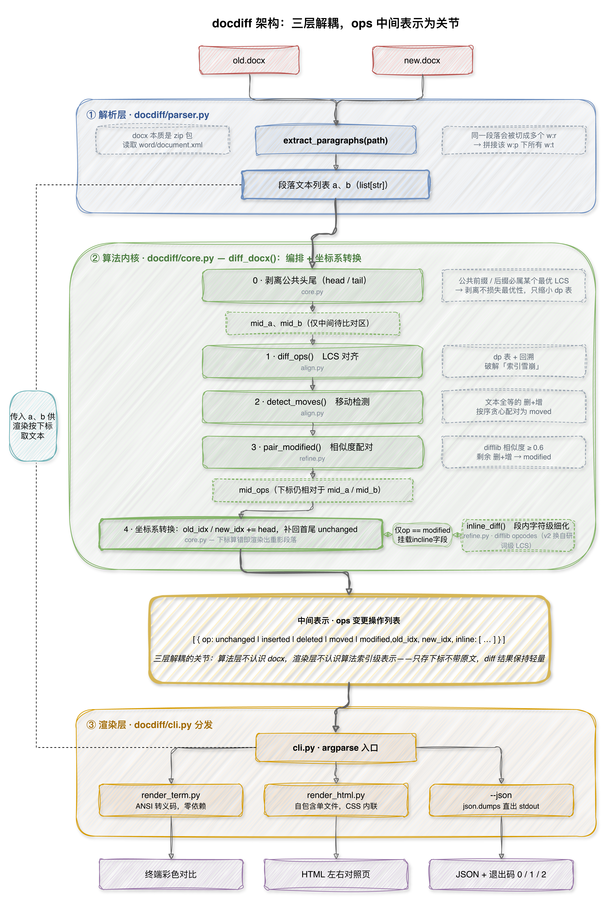
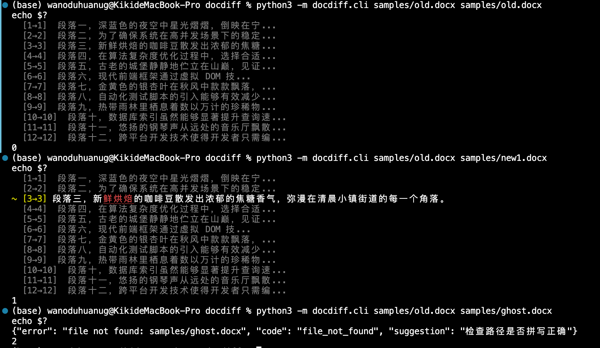
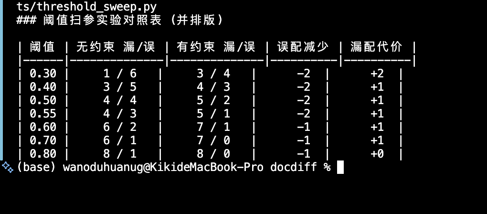
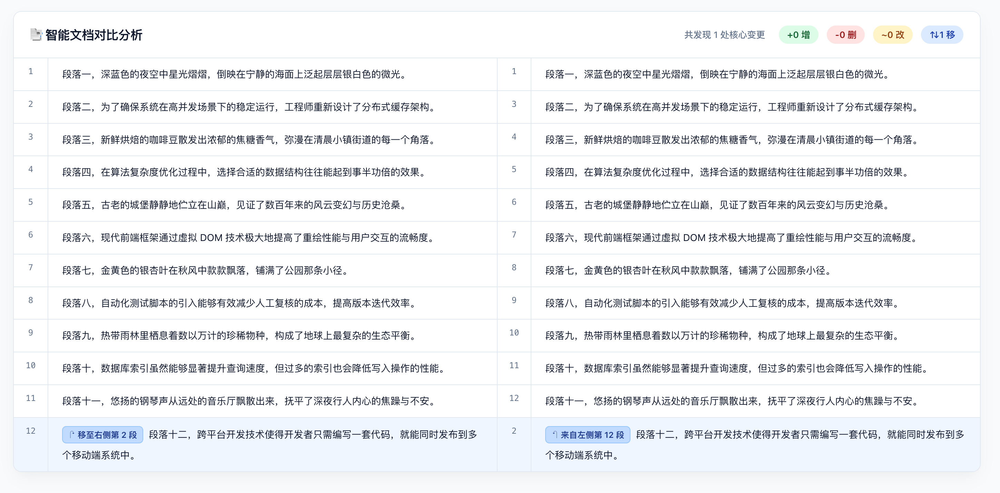

# docdiff

[](https://github.com/kikiwandouhuang-hub/docdiff/actions/workflows/test.yml)
[](https://github.com/kikiwandouhuang-hub/docdiff/actions/workflows/test.yml)
[](https://github.com/kikiwandouhuang-hub/docdiff)
[](LICENSE)

```bash
pip install git+https://github.com/kikiwandouhuang-hub/docdiff.git
```

## 简介

> Office-CLI 时代缺失的那条 diff 命令——对比两份 .docx 文档，输出结构感知、能识别移动、能看懂表格、且简洁易懂的变更报告。




## 版本演进

| 版本 | 内容 |
|---|---|
| **v0.1.0** | 段落级结构 diff：LCS 对齐、移动检测、掐头去尾优化，终端 / HTML / JSON 三种输出 |
| **v0.2.0** | 自研词级 LCS（V2-A）· Block 中间表示（V2-B）· 表格结构 diff（V2-C）· JSON 信封自包含（V2-D）· 格式变更检测（V2-E）· 工程化（V2-F） |

V2 里最危险的一步是 V2-B：中间表示从 `list[str]` 演进为 `list[Block]`，三层全穿透。这一步的意义在 V2-C 兑现——表格是二维结构，一维的对齐管线直接用不了，"按行对齐还是先对齐行再对齐单元格"本身就是一道没有现成答案的设计题（见 [docs/design-table-diff.md](docs/design-table-diff.md)）。

---

## Why: 为什么需要 docdiff？

### 一维雪崩：插入一段，全盘皆输

在对比文档时，如果使用传统的基于行号逐行对比方法，常会遇到一个致命痛点——索引雪崩。

假设你有一份 12 段的文档，仅在开头插入 1 个新段落。由于逐位置比较时后续内容全部错位，每处错位都会被记为一删一增，朴素对比会报出 12 段全部删除加上 13 段全部新增，共 25 处变更。正确答案显然应该是 1 处。

**docdiff 的解法：LCS 算法**
本工具采用 LCS 动态规划对齐段落，从全局视角寻找两份文档的最大共识骨架。对于 new2.docx 的首段插入测试，算法能够滤出这唯一的 1 个 inserted，其余后续段落依然被稳稳判定为 unchanged，解决了索引错位带来的雪崩问题。



上图即 new2 实验的输出：12 段中 11 段 unchanged，唯一的 1 处 inserted 定位在开头。

### 二维雪崩：表格插一行，整表重报

段落是一维序列，表格是二维结构。如果（像 v0.1.0 那样）把表格里的段落全部展平进段落流再对比，插一行会让后续所有行号 +1——整表每一行都被报成删+增，这就是二维雪崩。

docdiff 的解法：表格作为独立 Block 进文档级 LCS 对齐，配对成功后行级 LCS 对齐行、单元格级 diff 细化差异。tbl_new2 插一行的实际输出：整表只报 1 处 row_inserted。




---

## 核心架构

项目采用三层解耦架构。通过统一的变更操作列表 ops 作为中间表示——它是 Python 原生的字典列表结构，只有在终端执行 `--json` 时才会被序列化。解耦的程度有两次实证：V2-A 把段内 diff 从 difflib 换成自研词级 LCS，渲染层一行没改；V2-C 让 ops 从扁平变嵌套，两个渲染器都得改——**解耦保护内容维度、不保护结构维度**（见设计决策 10）。



## ops 类型总表：文档级 / 行级 / 单元格级

| 层级 | 载体 | 取值 | 来源 |
|---|---|---|---|
| 文档级 | `op` | `unchanged` / `inserted` / `deleted` / `moved` / `modified` / `formatted` | 块级 LCS + 相似度配对 |
| 行级 | `table_modified.rows[]` | `row_unchanged` / `row_inserted` / `row_deleted` / `row_moved` / `row_modified` | tablediff 行级 LCS |
| 单元格级 | `row_modified.cells[]` | `cell_unchanged` / `cell_modified` / `cell_inserted` / `cell_deleted` | tablediff 单元格 diff |

三层各有独立坐标系：文档级用 `old_idx/new_idx`，行级用 `old_row/new_row`，单元格级用 `old_col/new_col`。此外 `modified` 段落挂 `inline` 词级差异，`formatted` 挂 `changes` 格式指纹。一个嵌套的 JSON 样例：

```json
{ "schema": "docdiff/2", "tool_version": "0.2.0",
  "ops": [
    { "op": "table_modified", "old_idx": 6, "new_idx": 6,
      "rows": [
        { "op": "row_unchanged", "old_row": 0, "new_row": 0 },
        { "op": "row_inserted", "new_row": 1 },
        { "op": "row_modified", "old_row": 2, "new_row": 3,
          "cells": [
            { "op": "cell_unchanged", "old_col": 0, "new_col": 0 },
            { "op": "cell_modified", "old_col": 1, "new_col": 1,
              "inline": [ { "equal": "负责" }, { "delete": "市场" }, { "insert": "运营" }, { "equal": "宣传" } ] }
          ] } ] } ] }
```

---

## 安装与使用

### 环境准备

核心代码仅依赖 Python 3.10 及以上环境，运行时零第三方依赖，zipfile、xml、difflib、argparse 全是标准库。

```bash
pip install git+https://github.com/kikiwandouhuang-hub/docdiff.git   # 装好即有 docdiff 命令
# 或者克隆源码直接跑：
git clone https://github.com/kikiwandouhuang-hub/docdiff.git
cd docdiff
```

### 命令示例

**1. 默认终端彩色输出**
直观的 CLI 体验，在终端内渲染增删改移。
```bash
python3 -m docdiff.cli samples/old.docx samples/new1.docx
```

**2. HTML 报告输出**
生成一个内联了 CSS、完全自包含的 .html 单文件，双击即可在浏览器中审阅。
```bash
python3 -m docdiff.cli samples/old.docx samples/new3.docx --html out.html
```

**3. JSON 数据输出**
输出带 schema 版本号的信封，供其他程序消费；`--embed-text` 让输出自包含（脱离原文档也能用 `--from-json` 重新渲染，往返一致性有测试保证）。
```bash
python3 -m docdiff.cli samples/old.docx samples/new1.docx --json --embed-text
```

### 退出码
与 git diff 同款约定，对 CI/CD 友好：
| 退出码 | 含义 | 说明 |
|:---:|---|---|
| `0` | **无差异** | 内容一致。**存在格式差异时默认仍为 0**（输出提示），`--check-format` 才把格式纳入判定。 |
| `1` | **有差异** | 检测到文档存在实质性变更。 |
| `2` | **执行错误** | 抛出结构化报错输出至 stderr。 |



---

## 性能基准

段内词级 LCS 是 O(mn) 时间与空间。长段落会先走句级两级细化（段落 → 句子 → 词），全文无句界时退回 difflib 兜底——diff 工具卡住比 diff 得不够漂亮严重得多。以下数字来自 `experiments/bench.py`（5 组文档对 × 3 次取中位，macOS / Python 3.13，/usr/bin/time -l 量整次 CLI 调用）：

| 文档规模 | 变更比例 | 耗时 | 峰值内存 |
|---|---|---|---|
| 100 段 × 50 字 | 5% | 0.02s | 18 MB |
| 500 段 × 50 字 | 5% | 0.04s | 22 MB |
| 2000 段 × 50 字 | 5% | 0.39s | 57 MB |
| 500 段 × 50 字 | 50% | 0.18s | 23 MB |
| 500 段 × 50 字 + 20 表 | 5% | 0.04s | 22 MB |

三个结论：2000 段 0.39s，远低于 10s 红线，不需要 Hirschberg / array 优化项；50% 变更 0.18s vs 基线 0.04s（4.5×），是掐头去尾失效后 LCS 全量起效的真实成本——"最坏复杂度不变，降低的是真实输入下的计算量"现在有两个数字支撑；20 张表几乎零成本，表格钩子是组装后统一遍历一次，与文档规模线性。另外，2000 字的超长段落若直接跑词级 LCS 需要 400 万格 dp 表，句级两级细化降到 200×200 加若干句内小表，实测 0.02s。

---

## 阈值实验数据

所有阈值都来自扫参，不是拍脑袋。

**段落相似度阈值（最终 0.7 + 位置约束）：**

| 阈值 | 无约束 漏配/误配 | 有约束 漏配/误配 |
|---|---|---|
| 0.30 | 1 / 6 | 3 / 4 |
| 0.40 | 3 / 5 | 4 / 3 |
| 0.50 | 4 / 4 | 5 / 2 |
| 0.55 | 4 / 3 | 5 / 1 |
| 0.60 | 6 / 2 | 7 / 1 |
| 0.70 | 6 / 1 | 7 / 0 |
| **0.80** | 8 / 1 | 8 / 0 |



扫参过程给出三个结论：

1. **字符级相似度无法分离两类样本**。"近距离的同义改写"与"远距离的相似模板句"取值区间严重重叠，曲线在很宽的区间内平坦——真正的瓶颈是相似度度量本身，而不是阈值。
2. **位置约束把误配物理清零**。基于 LCS `unchanged` 锚点的局部坐标系位置约束（`POSITION_WINDOW = 2`）：无约束时 0.7 仍有 1 处误配，有约束后为 0。
3. **最终取 0.7**：误配为 0 的前提下加权代价最低（0.5 有约束时误配仍有 2 处，权衡后舍弃）。

**表格与行阈值（0.5）：** 正样本（改格 / 插行 / 移行 / 插列）相似度最小 0.750，负样本（无关表 / 行序颠倒 / 大部分行重写）最大 0.333，0.5 分离干净。插列样本的行键整体错位、行级覆盖率必然为 0——于是列数不同时转置到列视角再算一次列级 LCS 兜底，边界情况靠度量兜底而不是靠特判。

---

## ⚠️ 已知边界


| # | 边界 | 说明 |
|---|---|---|
| 1 | **合并单元格** | `w:gridSpan` / `vMerge` 不解析。含合并单元格的表格在渲染时显示警告，行内 diff 可能错位。 |
| 2 | **样式继承** | 格式检测只读 run 的直接格式（`w:rPr`）；经 styles.xml 默认样式施加的差异（如两份文档默认字体不同）会漏报。 |
| 3 | **页眉页脚 / 脚注 / 文本框** | 只对比 body 的直接子节点，这些部件不进 diff。 |
| 4 | **WPS 私有格式** | 样本全部由 Microsoft Word 生成，WPS 写入的私有扩展标记未覆盖。 |
| 5 | **超长段落降级** | 无句界的超长段落，词级 LCS 规模超限时退回 difflib 兜底——宁可不那么漂亮，不许卡死。 |

另外，约 18% 的"修改 + 移动"组合型修改会降级为删+增（见上节阈值数据），这是位置约束的已知代价。

---

## Roadmap

已完成：

- [x] ~~表格 Diff~~ → V2-C：行级 / 单元格级增删改移追踪
- [x] ~~格式变更检测~~ → V2-E：`formatted` op + `--check-format`
- [x] ~~序列化原文~~ → V2-D：`--embed-text` + `--from-json` 往返验证

V3 演进方向：

- [ ] **Redline 修订模式**：逆向生成一份带 Word 原生修订标记的 .docx 成果文件。 **P0**
- [ ] **三方 Merge**：支持类似 Git 的三方合并（base / ours / theirs → 合并结果）。 **P1**
- [ ] **MCP 模式接入**：与大语言模型协议打通，提供基于变更日志的自动摘要与解读。 **P1**
- [ ] **docblame**：变更历史溯源，定位每一处修改的来源。 **P2**
- [ ] **xlsx 公式对比**：扩展支持 Excel 隐藏的底层公式变更（先做相对引用 + 单表子集，其余划边界）。 **P2**

---

## 设计决策与踩坑记录

在开发过程中，我做出了一些影响深远的技术取舍：

1. **为什么不用 Run 节点作为对比单位？**
   在解剖 OOXML 时发现，Word 内部对 Run 节点的切分极其随性，常常因为拼写检查或字体微调，将一句话切得稀碎。拿 Run 节点做对比会导致满屏的假变更。因此我坚决在解析器层将段落内部所有的文本强行拼合成完整字符串。
2. **掐头去尾优化的真实收益**
   在处理真实文档时，我剥离了首尾相同的段落，仅对中间差异区跑 LCS。这一操作在数学上是安全的，因为公共前缀必然属于某个最优解。最坏情况下的复杂度上限不变，依然是 m 乘 n 的规模；但真实文档绝大部分段落未变，dp 表实际只覆盖差异区，计算量大幅下降。
3. **操作列表采用纯索引级表示设计**
   变更操作列表 ops 字典中仅存储 old_idx 和 new_idx 下标，不携带原文。这在节省内存消耗的同时，渲染器依然可以通过传入的文本列表按索引完成取词，没有破坏三层架构的解耦性。这是索引级表示的边界：JSON 输出不能脱离原文独立复用——`--embed-text` 提供了出口，且往返一致性有测试保证（`tests/test_roundtrip.py` 用 `diff` 一条命令证明渲染层只依赖 ops + blocks）。
4. **重复段落的贪心配对**
   如果文档中有多个相同的段落发生了移动，该如何映射来源？我在 detect_moves 中引入了按文档顺序贪心配对策略。这确保了算法底层每个下标仅出现一次的不变量不被破坏，同时在视觉渲染上符合人类直觉。
   下图为 new3 验金石的 HTML 输出，moved 标注清晰可见：
   
5. **特征解耦：位置约束 + 相似度阈值 0.7**
   本系统的段落相似度阈值最终定为 0.7。在前期扫参实验中，我发现纯文本的字符级相似度根本无法区分"近距离的同义改写"与"远距离的相似模板句"，两者取值区间严重重叠。面对高昂的误配代价，我没有选择盲目拔高相似度阈值，而是引入了基于 LCS `unchanged` 锚点的"局部坐标系位置约束"。约束成立后，0.5 即可行（误配仅 2 处），但消融对比显示 0.7 的加权代价最低且误配为 0——最终取 0.7，代价是约 18% 的"修改+移动"类修改按设计降级为删+增（见已知边界）。
6. **分词零依赖（V2-A）**
   段内词级 LCS 需要分词，但我坚持不引 jieba：零依赖是写进 README 的卖点，为一个次要体验牺牲主要卖点不划算。自研规则分词器（CJK 逐字 + 拉丁成词 + 标点切分）只有几十行，还顺手把 `isalnum()` 对汉字返回 True 的坑写成回归测试钉死了。
7. **Block 的 `__eq__` 是身份相等（V2-B）**
   两个内容完全相同的 Block 不等于——相等只比较身份。对齐全程只用 `key()`，载荷字段（fmt、rows）对齐法层完全不可见。这就是为什么加表格、加格式指纹时，算法层一行都没改。
8. **表格三方案取舍（V2-C）**
   全展平（方案 A）会把一维雪崩原封不动搬进二维——插一行整行 inserted、插一列全部单元格错位；二维双向 LCS（方案 C）复杂度 O(m²n²)，而真实修订里表格改动 90% 是改单元格和增删行——为一个罕见场景付四次方，不划算。最终选分层对齐（方案 B）：表格作为 Block 进文档级 LCS，配对后行级 / 单元格级复用 seqdiff，不引入新算法。完整取舍见 [docs/design-table-diff.md](docs/design-table-diff.md)。
9. **formatted 默认不计差异（V2-E）**
   diff 的粒度是产品决策不是技术决策：只改了加粗、文本没变，该报 unchanged 还是新的 formatted？我的答案是 formatted 存在、但默认不进差异判定（exit 0 + 提示），`--check-format` 显式 opt-in。理由：CI 里最常见的诉求是"内容变了吗"，格式变更（尤其样式继承导致的）噪声大、误报代价高；退出码是 CI 的行为契约，不能拍脑袋。
10. **解耦保护内容维度、不保护结构维度（V2-C）**
    V2-A 换段内算法，渲染层零改动；V2-C 让 ops 从扁平变嵌套，两个渲染器都得改——因为嵌套是结构变化。规律成立，写实了：抽象边界划在哪里，决定了改动的爆炸半径。
